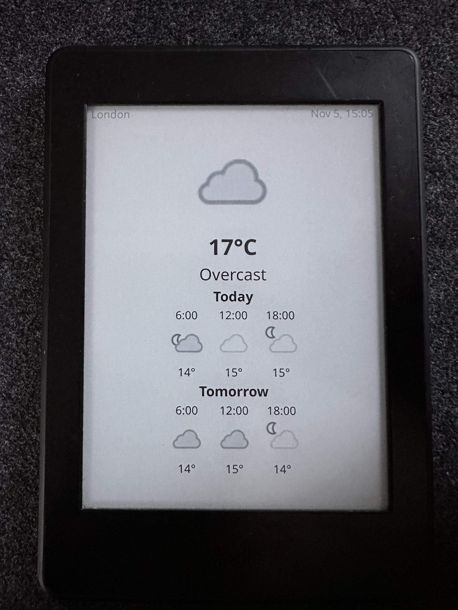
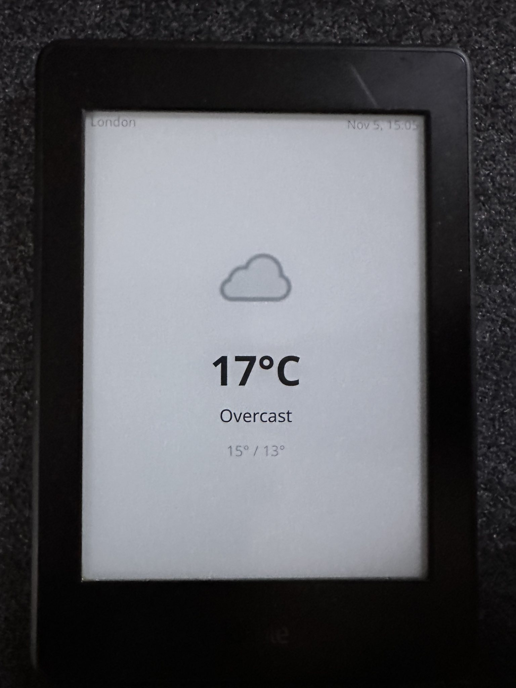
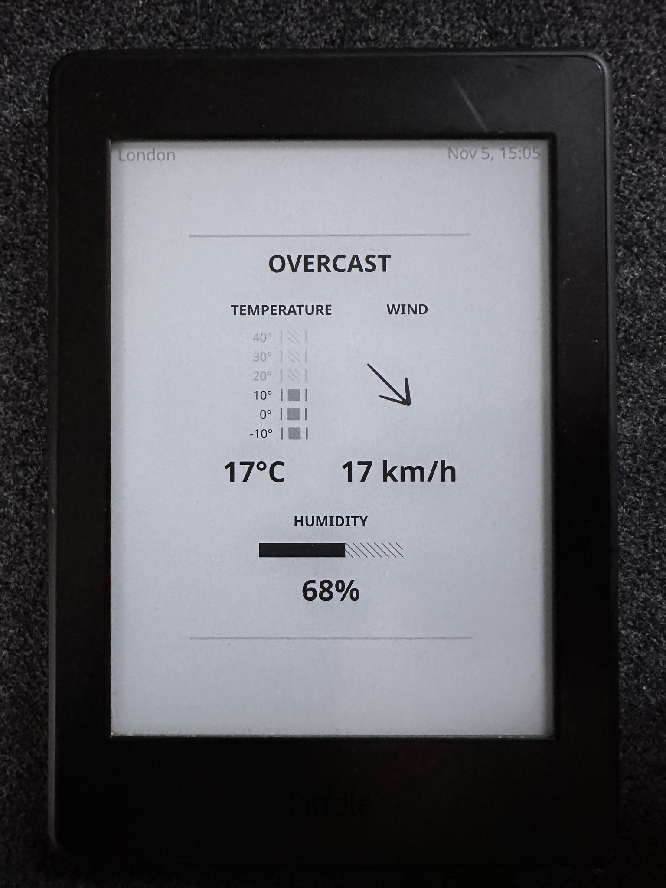
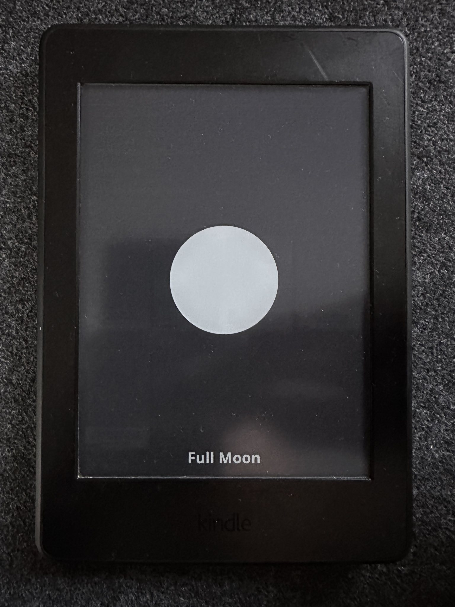

# Weather Lockscreen Plugin for KOReader

A comprehensive KOReader plugin that displays beautiful weather information on your device's sleep screen.

## Features

- **Real-time Weather Data** - Displays current weather conditions with icons, temperature, and detailed descriptions
- **Several Display Formats** - Choose from multiple layout options to suit your preferences
- **Easy Configuration** - Configure settings via main menu, no need to edit source code
- **Smart Caching** - Automatic caching with configurable expiration
- **Offline Support** - Uses cached data when internet connection is unavailable

## Installation

1. Download the latest release from the [Releases](https://github.com/loeffner/WeatherLockscreen/releases) page
2. Extract the `weatherlockscreen.koplugin` folder
3. Copy it to your KOReader plugins directory:
   - **Kindle**: `/mnt/us/koreader/plugins/`
   - **Kobo**: `/mnt/onboard/.adds/koreader/plugins/`
   - **Android**: `/sdcard/koreader/plugins/`
4. Restart KOReader

## Configuration

### Initial Setup

<table>
  <tr>
    <td valign="top">
      <ol>
        <li>Navigate to <b>Tools &gt; Weather Lockscreen</b></li>
        <li>Configure the following:
          <ul>
            <li><b>Location</b>: Enter your location (city name, airport code, us postal code, or coordinates)
               <i>Examples: "London", "MUC", "10001", "48.8567,2.3508"</i>
            </li>
            <li><b>Temperature Scale</b>: Choose Celsius (°C) or Fahrenheit (°F)</li>
            <li><b>Display Format</b>: Select your layout</li>
          </ul>
        </li>
        <li>Navigate to <b>Settings &gt; Screen  &gt;  Sleep Screen  &gt;  Wallpaper </b></li>
          <ul>
            <li><a href="https://github.com/koreader/koreader/issues/14098">KOReader's "Sleep Screen" option is only exposed if you have ads disabled</a>.</li>
          </ul>
        <li>Select <b>"Show weather on sleep screen" </b></li>
      </ol>
    </td>
    <td valign="top" width="220">
       
       
      
    </td>
  </tr>
</table>

## Display Modes

The plugin offers several display formats to customize your lockscreen:

<table>
  <tr>
    <td align="center">
      <strong>Detail Display</strong> 
      
    </td>
    <td align="center">
      <strong>Minimal Display</strong> 
      
    </td>
  </tr>
  <tr>
      <td align="center">
      <strong>Cover Display</strong> 
      
    </td>
    <td align="center">
      <strong>Retro Analog Display</strong> 
      
    </td>
  </tr>
  <tr>
    <td align="center">
      <strong>Night Owl Display</strong> 
      
    </td>
    <td></td>
  </tr>
</table>

## How It Works

1. **Data Fetching**: Weather data is automatically fetched from WeatherAPI.com when your device enters sleep mode
   * To avoid unnecessary api calls, the data is only refreshed, if the cached data is older than 30 minutes.
   * Changing the location or deleting the cache forces an update.
2. **Caching**: Data is cached locally for a configurable amount of time (1h - 24h)
3. **Offline Mode**: If the API request fails or no internet connection is available, the plugin uses cached data
4. **Fallback Display**: If no cached data is available, displays a sun/moon icon based on the current time of day

## API Information

The plugin uses [WeatherAPI.com](https://www.weatherapi.com/)'s forecast endpoint. \
It uses my account and API Key. Please be responsible, otherwise I can not sustain this plugin. \
You can create your own account and API key at [WeatherAPI.com](https://www.weatherapi.com/).
The free tier allows 1 000 000 API calls per month.

## Localization

The plugin supports multiple languages through a hybrid localization approach:

### What Gets Translated and How

1. **Weather Conditions** - Automatically translated by WeatherAPI in 40+ languages (see list below)
2. **Day/Month Names** and a few other common words/phrases - Use KOReader's system localization
3. **Plugin UI Strings** - Menu items, settings, and display labels are translated via `.po` files

### Current Translation Status

**Fully Translated Languages:**
- 🇩🇪 German (de) - Complete

**English (en)** - Default language (no translation needed)

### Contributing Translations

I welcome translation contributions! The plugin uses standard gettext `.po` files for localization.
If you want to contribute, but don't know how, feel free to open an issue.

Supported languages by WeatherAPI

    ar = "ar",         -- Arabic
    bg_BG = "bg",      -- Bulgarian
    bn = "bn",         -- Bengali
    cs = "cs",         -- Czech
    da = "da",         -- Danish
    de = "de",         -- German
    el = "el",         -- Greek
    es = "es",         -- Spanish
    fi = "fi",         -- Finnish
    fr = "fr",         -- French
    hi = "hi",         -- Hindi
    hu = "hu",         -- Hungarian
    it_IT = "it",      -- Italian
    ja = "ja",         -- Japanese
    ko_KR = "ko",      -- Korean
    nl_NL = "nl",      -- Dutch
    pl = "pl",         -- Polish
    pt_PT = "pt",      -- Portuguese
    pt_BR = "pt",      -- Portuguese (WeatherAPI only supports one pt variant. I think, its better to use it than to default to english)
    ro = "ro",         -- Romanian
    ro_MD = "ro",      -- Romanian (WeatherAPI only supports one ro variant. I think, its better to use it than to default to english)
    ru = "ru",         -- Russian
    si = "si",         -- Sinhalese
    sk = "sk",         -- Slovak
    sr = "sr",         -- Serbian
    sv = "sv",         -- Swedish
    ta = "ta",         -- Tamil
    te = "te",         -- Telugu
    tr = "tr",         -- Turkish
    uk = "uk",         -- Ukrainian
    ur = "ur",         -- Urdu
    vi = "vi",         -- Vietnamese
    zh_CN = "zh",      -- Chinese Simplified
    zh_TW = "zh_tw",   -- Chinese Traditional

## Customization

Displayed hours in "Detailed" display

You can find a user patch to modify the hours here:
[2-weather-detailed-view-hours.lua](https://github.com/loeffner/KOReader.patches?tab=readme-ov-file#-2-weather-detailed-view-hourslua)

Fallback Icons (sun/moon)

You can customize the fallback sun/moon icons:

1. Create or download `sun.svg` and `moon.svg` icons
2. Place them in `<koreader_data_dir>/icons/`
3. The plugin will use these icons when weather data is unavailable

## Troubleshooting

Weather not displaying

- Check your internet connection
- Ensure your location is entered correctly
- Check the KOReader log for error messages

Icons not showing

- Ensure you have an active internet connection for the first fetch
- Weather icons are automatically downloaded and cached
- Check the cache directory has write permissions

Outdated weather data

- Weather data is cached for the configured time (1 hour default)
- Enter sleep mode again to force a refresh after the cache expires
- Check your internet connection

## Contributing

Contributions are welcome! Please feel free to submit a Pull Request.

## Work in Progress for 0.9.2

Done

In progress

- Localization: Support more languages
- Periodically refresh the lockscreen (its not easy, let me tell you that!)
- Attempt connecting to wifi: See #1

Backlog

- More display modes: I am always open for requests.
- A transparent display mode (either transparent image over weather or transparent weather over image)
- Fallback: A more configurable fallback, when no weather data is available.

## Related Projects

- [KOReader](https://github.com/koreader/koreader) - The main KOReader project
- [WeatherAPI.com](https://www.weatherapi.com/) - Weather data provider
- [roygbyte/weather.koplugin](https://github.com/roygbyte/weather.koplugin/) - Inspiration for this project
- [svgrepo.com](https://www.svgrepo.com/) - Provider of the arrows for the wind direction in the Retro Analog view

### My user patches

- [loeffner/KOReader.patches](https://github.com/loeffner/KOReader.patches)

## Author

**Andreas Lösel**

## License

This project is licensed under the GNU Affero General Public License v3.0 - see the [LICENSE](LICENSE) file for details.
